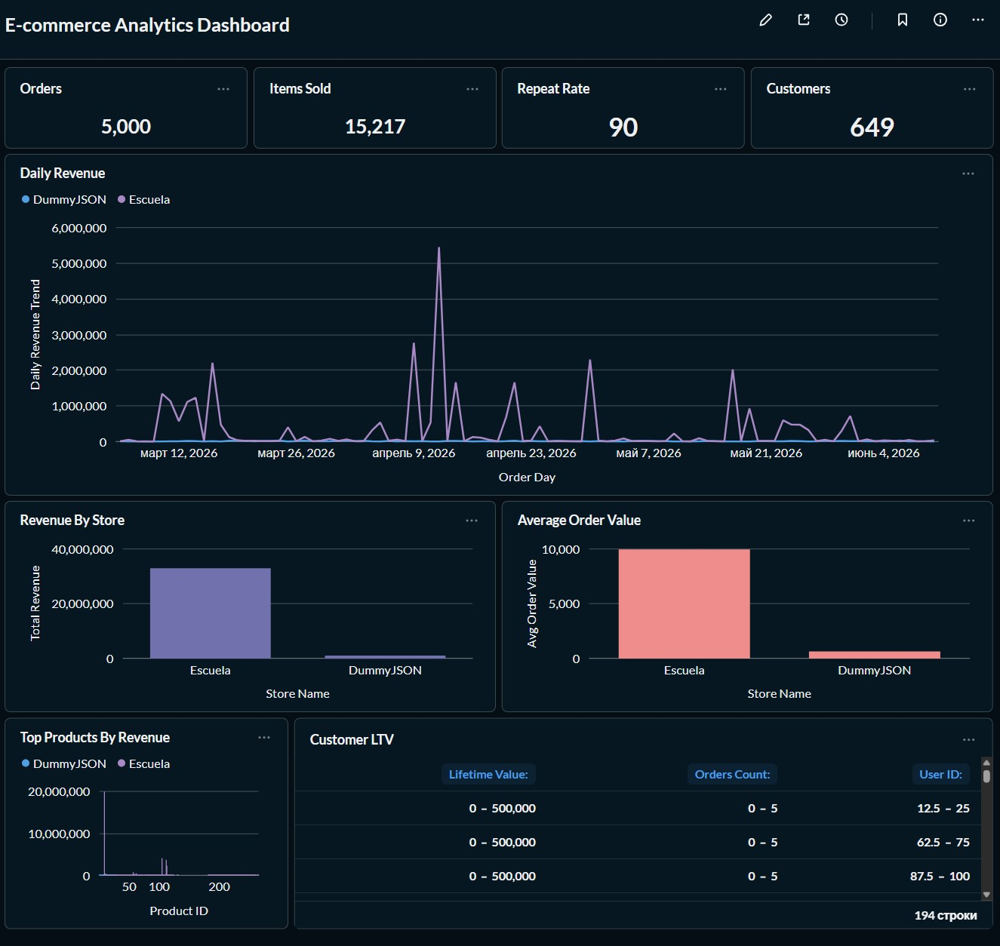

# E-commerce Analytics Platform

An end-to-end analytics project built around two public e-commerce APIs.

The pipeline ingests raw data into PostgreSQL, transforms it with dbt using the Medallion architecture (Bronze → Silver → Gold), runs scheduled workflows with Airflow, and exposes business metrics through Metabase.

The goal of the project was to build a small analytics stack that resembles a real production workflow rather than another ETL demo.

---

# Architecture

```text
DummyJSON API      Escuela API
       │                 │
       └─────────┬───────┘
                 ▼
          Python ETL
                 ▼
      PostgreSQL (Bronze)
                 ▼
      dbt Models (Silver)
                 ▼
       dbt Models (Gold)
                 ▼
      Metabase Dashboard

      Airflow
(dbt run → dbt test)
```

---

# Tech Stack

| Layer            | Technology         |
| ---------------- | ------------------ |
| Language         | Python             |
| Storage          | PostgreSQL 15      |
| Transformations  | dbt                |
| Orchestration    | Apache Airflow 2.8 |
| Visualization    | Metabase           |
| Containerization | Docker Compose     |
| Testing          | pytest, dbt tests  |
| Code Quality     | Ruff               |
| Version Control  | Git, GitHub        |

---

# Pipeline

The project follows a simple Medallion workflow.

**Bronze** stores raw API responses exactly as they were received.

**Silver** is responsible for cleaning and validation. JSON fields are unpacked into structured columns, invalid records are removed, duplicates are handled, and orders are processed incrementally.

**Gold** contains reporting models used by Metabase. These tables power dashboards with revenue trends, customer lifetime value, repeat customers, and other business metrics.

---

# Incremental Processing

Orders are processed incrementally using dbt.

```sql

WHERE created_at > (SELECT MAX(created_at) FROM {{ this }})

```

The first execution loads the complete dataset. Every following run processes only newly arrived orders.

```
1st run → Full load
2nd run → No new records
3rd run → One new order processed
```

Incremental models are only used where they provide a real benefit. Small lookup tables such as products or users are rebuilt from scratch because they're inexpensive to refresh and keeping them incremental would only add unnecessary complexity.

---

# Orchestration

Airflow schedules the transformation pipeline every night.

```
dbt run
      ↓
dbt test
```

If model execution fails, the validation step is skipped automatically.

Instead of running dbt in a separate container, it is installed directly into the Airflow image. This keeps the deployment simpler and avoids mounting the Docker socket into the scheduler container.

---

# Data Quality

Every pipeline run executes dbt tests before the data reaches the reporting layer.

Current coverage includes:

* `not_null`
* `unique`
* `accepted_values`

```
PASS=19 WARN=0 ERROR=0
```

---

# Dashboard

The reporting layer is built in Metabase on top of the Gold models.

The dashboard tracks:

* revenue
* average order value
* customer lifetime value
* repeat customer rate
* top-selling products
* monthly sales trends



---

# Sample Insights

Using the provided demo datasets:

| Metric              |       Escuela | DummyJSON |
| ------------------- | ------------: | --------: |
| Revenue             |         ~$30M |    ~$300K |
| Average Order Value |      ~$10,000 |     ~$700 |
| Market Profile      | Premium / B2B |    Budget |

Both datasets show a revenue peak in April 2026. Since the source data is synthetic, this shouldn't be treated as a real business pattern, but it demonstrates how the reporting layer highlights trends worth investigating.

---

# Project Structure

```text
E-commerce-analytics-platform/
├── config/
├── dags/
├── database/
├── dbt/
├── src/
├── tests/
├── utils/
├── docker-compose.yml
├── Dockerfile
├── Dockerfile.airflow
├── main.py
└── requirements.txt
```

---

# Getting Started

```bash
git clone https://github.com/offANTI/E-commerce-analytics-platform.git
cd E-commerce-analytics-platform

docker compose up -d

docker exec -it bsg_etl_app python main.py
```

Airflow:

```
http://localhost:8080
```

Metabase:

```
http://localhost:3000
```

---

# Current Limitations

The ETL application currently runs separately from the Airflow DAG.

The main reason is a dependency mismatch: the ETL uses Python 3.11 with Pydantic v2, while Airflow 2.8 is based on Python 3.8. Combining both environments would make the deployment unnecessarily fragile.

In a production setup I'd isolate the ETL completely and trigger it through `KubernetesPodOperator`, allowing Airflow and the ETL to use independent Python environments.

---

# What's Next

* add CI with GitHub Actions
* improve test coverage
* introduce data freshness monitoring
* migrate to object storage for raw data
* deploy the platform to Kubernetes

---

## Author

**Ruslan Tuliei**

GitHub: https://github.com/offANTI
