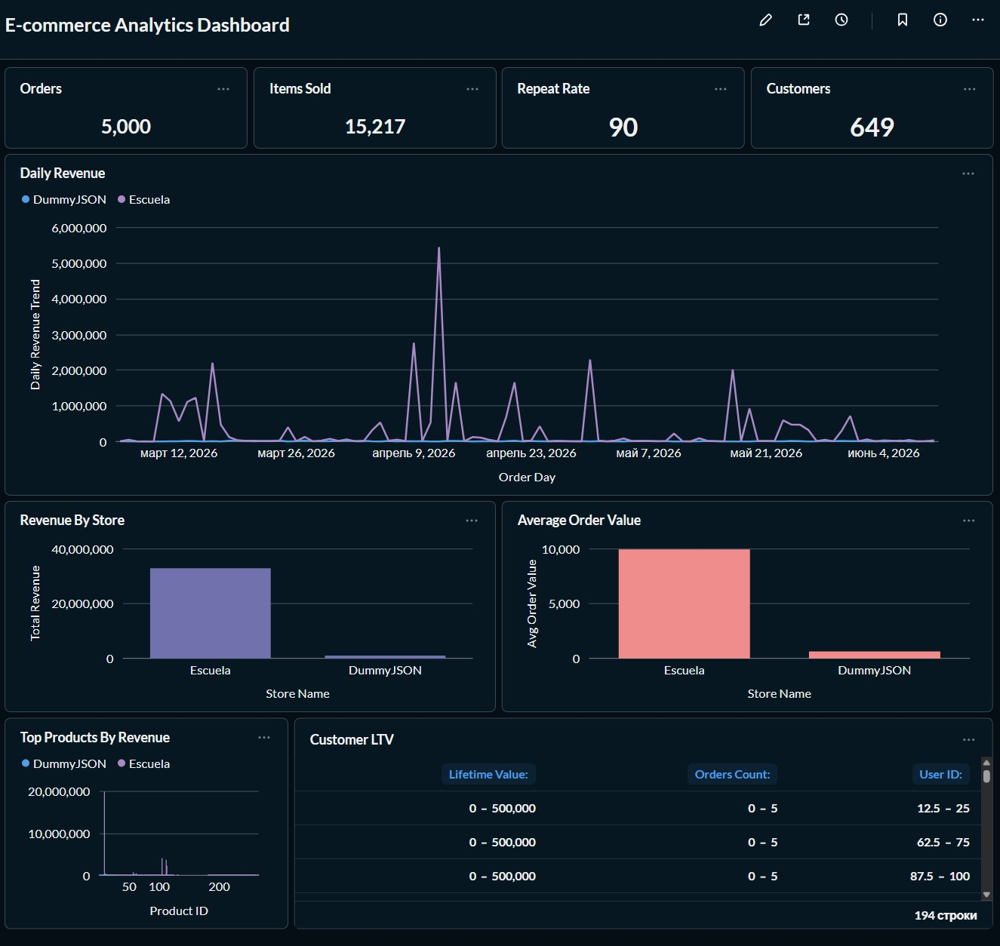

# E-commerce Analytics Platform

I built this to understand what a real analytics stack actually feels like to build and run  not another "ETL demo" that ends at a single script, but something with the pieces production data teams actually deal with: orchestration, testing, incremental loads, and a reporting layer someone could genuinely look at.

The pipeline pulls from two public e-commerce APIs (DummyJSON and Escuela), lands raw data in PostgreSQL, transforms it through dbt using a Bronze → Silver → Gold structure, runs on a nightly Airflow schedule, and surfaces business metrics in Metabase.

There's also a second, parallel implementation of the same pipeline on Azure/Databricks - more on that below.

---

## Why Postgres + dbt + Airflow

I wanted a stack that's genuinely common in mid-size data teams, not the flashiest possible tools. Postgres because it's what most companies actually run in production before they need something bigger. dbt because SQL-based transformations with built-in testing and lineage are how most analytics engineering teams actually work today. Airflow because it's still the most widely used orchestrator, even with newer alternatives around - knowing it is a practical skill, not a nostalgic one.

---

## Architecture

```text
DummyJSON API      Escuela API
       │                 │
       └─────────┬───────┘
                 ▼
          Python ETL
                 ▼
      PostgreSQL (Bronze)
                 ▼
      dbt Models (Silver)
                 ▼
       dbt Models (Gold)
                 ▼
      Metabase Dashboard

      Airflow
(dbt run → dbt test)
```

---

## Tech Stack

| Layer            | Technology                  |
| ---------------- |-----------------------------|
| Language         | Python                      |
| Storage          | PostgreSQL 15               |
| Transformations  | dbt                         |
| Orchestration    | Apache Airflow 2.8          |
| Visualization    | Metabase                    |
| Containerization | Docker Compose              |
| Testing          | pytest, dbt tests           |
| Code Quality     | Ruff (linting + formatting) |
| Version Control  | Git, GitHub                 |

---

## How the pipeline actually works

**Bronze** keeps raw API responses exactly as they came in - no parsing, no assumptions. If something upstream changes shape, I want to see it here first, not lose it in a transformation.

**Silver** is where the real cleaning happens: unpacking JSON into proper columns, dropping invalid records, deduplicating, and processing orders incrementally.

One thing I learned the hard way while debugging this layer: deduplication isn't a one-size-fits-all decision. I originally deduplicated users by email, until I noticed the source data had the same `user_id` showing up with *different* emails across snapshots (people updating their profile between API pulls). Deduplicating by the actual entity key (`user_id`, keeping the latest snapshot) was the correct fix - email alone wasn't a reliable identity.

**Gold** holds the reporting models Metabase reads from - revenue trends, customer lifetime value, repeat customers, and similar business metrics.

---

## Incremental processing

Orders are processed incrementally in dbt:

```sql

WHERE created_at > (SELECT MAX(created_at) FROM {{ this }})

```

First run loads everything. Every run after that only touches new orders.

```
1st run → Full load
2nd run → No new records
3rd run → One new order processed
```

I only use incremental models where they earn their complexity. Small lookup tables like products or users get rebuilt from scratch every run - they're cheap to refresh, and making them incremental would just be extra moving parts for no real gain.

---

## Orchestration

Airflow runs the pipeline nightly:

```
dbt run
      ↓
dbt test
```

If the models fail, the test step is skipped automatically rather than testing against broken data.

dbt is installed directly into the Airflow image rather than run in a separate container - simpler deployment, and it avoids mounting the Docker socket into the scheduler.

---

## Data quality

Every run executes dbt tests before anything reaches the reporting layer: `not_null`, `unique`, `accepted_values`.

```
PASS=18 WARN=0 ERROR=0
```

Some of these tests caught real issues during development  - not just schema typos, but genuine data quality problems in the source APIs (duplicate user records from a shared public demo API, invalid price ranges). That's the actual value of testing a pipeline like this: it surfaces the messy reality of external data instead of assuming it's clean.

---
## Continuous Integration

GitHub Actions runs on every push: pytest for the ETL code, and CodeQL for static security analysis.

## Dashboard

Built in Metabase on top of the Gold models. Tracks revenue, average order value, customer lifetime value, repeat customer rate, top-selling products, and monthly trends.



---

## Sample insights

| Metric              |       Escuela | DummyJSON |
| -------------------- | ------------: | --------: |
| Revenue               |         ~$30M |    ~$300K |
| Average Order Value    |      ~$10,000 |     ~$700 |
| Market Profile          | Premium / B2B |    Budget |

Both datasets show a revenue peak in April 2026 - worth noting the source data is synthetic, so this isn't a real business signal, but it's a good example of the kind of pattern this reporting layer is built to surface.

---

## Azure / Databricks version

I also rebuilt the Bronze → Silver pipeline on Azure - Storage (ADLS Gen2) instead of Postgres, Databricks instead of Airflow, Delta Lake instead of plain tables. Same source APIs, same business logic, different infrastructure.

A few decisions worth explaining:

- **Managed Identity over access keys** for Databricks → Storage auth, so no secrets live in code or config.
- **`MERGE INTO` for Silver, not full overwrite** = same idea as the incremental dbt models above, just expressed through Delta Lake's upsert semantics instead of a `WHERE` clause and a watermark column.
- **Deduplication before every merge** = Delta's `MERGE` fails outright if the source has multiple rows matching the same target key, which is exactly what happens on repeated pipeline runs against an append-only Bronze layer. Each Silver transformation now dedupes by its entity key, keeping the most recent snapshot, before merging.

This isn't a replacement for the Postgres/dbt version = it's a second implementation of the same problem, mostly built to get real, hands-on experience with the Azure/Databricks stack rather than to "upgrade" anything.

Code lives in `azure_databricks/`.

---

## Project structure

```text
E-commerce-analytics-platform/
├── azure_databricks/
├── config/
├── dags/
├── database/
├── dbt/
├── src/
├── tests/
├── utils/
├── docker-compose.yml
├── Dockerfile
├── Dockerfile.airflow
├── main.py
└── requirements.txt
```

---

## Getting started

```bash
git clone https://github.com/offANTI/E-commerce-analytics-platform.git
cd E-commerce-analytics-platform

docker compose up -d

docker exec -it bsg_etl_app python main.py
```

Airflow: `http://localhost:8080`
Metabase: `http://localhost:3000`

---

## Current limitations

The ETL app runs separately from the Airflow DAG right now. The blocker is a dependency mismatch = the ETL uses Python 3.11 with Pydantic v2, Airflow 2.8 is on Python 3.8. Forcing them into one environment would make the whole deployment fragile for no good reason.

In a real production setup, I'd isolate the ETL entirely and trigger it through `KubernetesPodOperator`, so Airflow and the ETL can each run their own Python environment without fighting each other.

---

## What's next

- Data quality checks for the Azure/Databricks version = the Postgres side has dbt tests, the PySpark side doesn't have an equivalent yet
- Move orchestration on the Azure side from manual notebook runs to Databricks Workflows
- Add CI coverage for `azure_databricks/` = the current GitHub Actions setup covers `src/` and `dbt/`, not the PySpark code
- Data freshness monitoring on the Postgres pipeline

---

## Author

**Ruslan Tuliei**
GitHub: https://github.com/offANTI